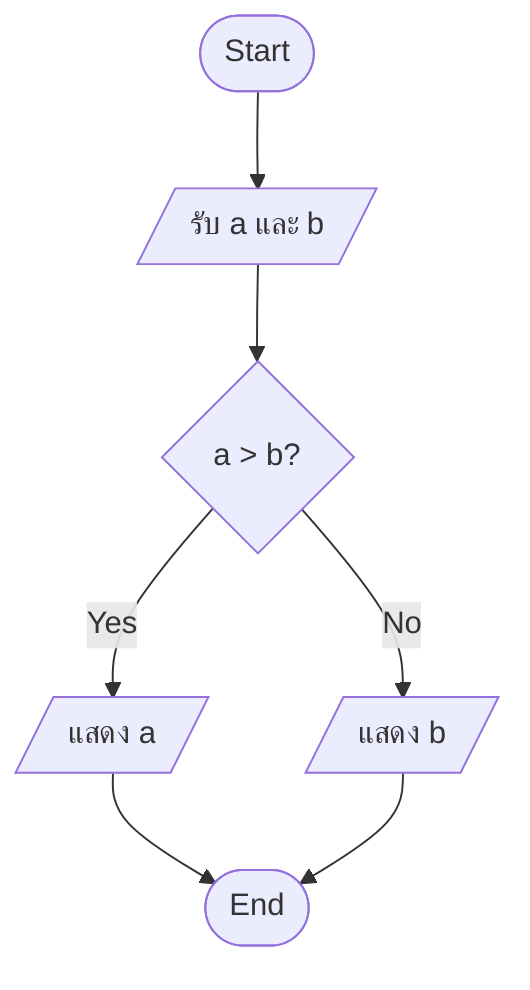
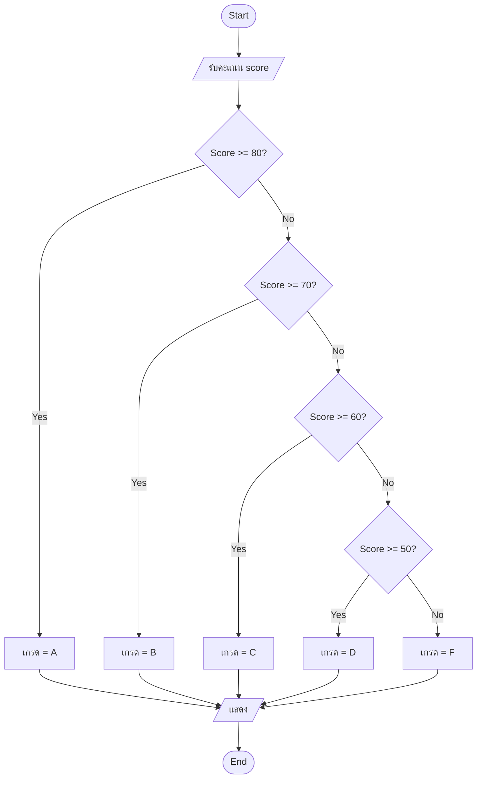
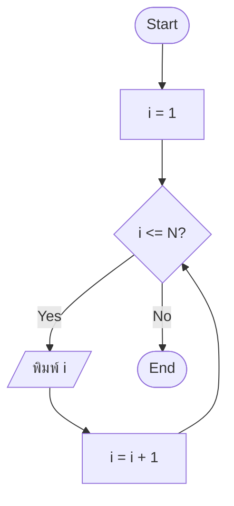

```mermaid
flowchart TD
Start([Start]) --> Input[/รับ a และ b/]
Input --> D1{a > b?}
D1 -->|Yes| a[/แสดง a/]
D1 -->|No| b[/แสดง b/]
a & b-->End([End])
```

```

```



```mermaid
flowchart TD
Start([Start]) --> Input[/รับคะแนน score/]
Input --> D1{Score >= 80?}
D1 -->|Yes| A[เกรด = A]
D1 -->|No| D2{Score >= 70?}
D2 -->|Yes| B[เกรด = B]
D2 -->|No| D3{Score >= 60?}
D3 -->|Yes| C[เกรด = C]
D3 -->|No| D4{Score >= 50?}
D4 -->|Yes| D[เกรด = D]
D4 -->|No| F[เกรด = F]
A & B & C & D & F-->Output[/แสดง/]
Output-->End([End])
```


```mermaid
flowchart TD
Start([Start])-->Input[/รับ N/]
 Input[i = 1]
 -->a{i <= N?}
 a -->|Yes| b[/พิมพ์ i/]
 a -->|No| c([End])
 b -->d[i = i + 1]-->a
```

```

```

```

```
